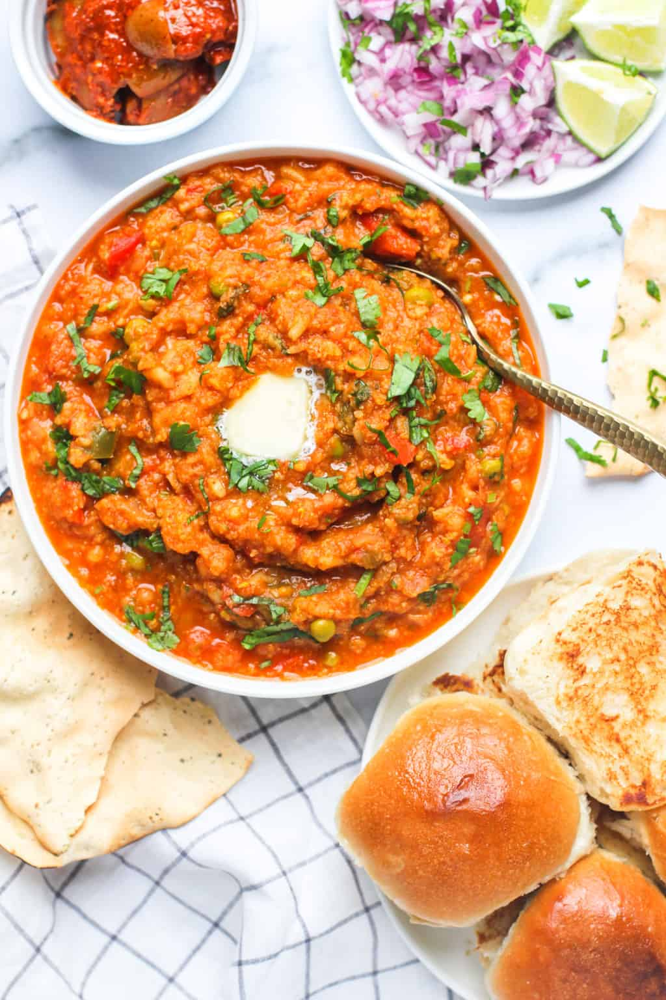
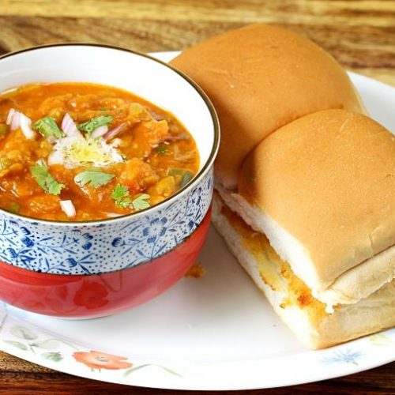

# assignment2-Madhari
# Narsing Rao Nikitha Madhari
###### Pav bhaji
Pav bhaji is a fast food **from India** that consist of spicy mix vegetable mash and soft buns. Its origin are in the state of Maharashtra. I Like it because it is made of  **all kinds of vegetables**.



---
Programmer analyst
1. A program analyst is responsible for the development of new and improved computer program.
2. Organizing information about a problem to be addressed or a procedure to be improved.

- Program Analysts use strong problem solving and analytical skills to help organizations improve their programs.
- They research, gather and analyze complex data to identify trends and develop reports with their recommendations for Improvement.

[About Me](AboutMe.md)

---

I am sharing few of my favorite places which i would recommend to visit.
|Location| Time | Expenditure |
|:---: | :---: | :---: |
|Nepal| 6 | $600 |
|Varanasi| 5 | $500 |
|Goa | 4 | $300 |

---
# My favorite qoutes

1. "Float like a butterfly, Sting like a bee."-*Muhammad Ali*
2. "The way to get started is to quit talking and begin doing."-*WaltDisney*

---
# Code fencing
> Lite-C is a programming language for multimedia applications and personal computer games, using a syntax subset of the C language with some elements of the C++ language. Its main difference to C is the native implementation of multimedia and computer game related objects like sounds, images, movies, GUI elements, 2D and 3D models, collision detection and rigid body physics. 

source link:<https://en.wikipedia.org/wiki/Lite-C>

```
void main()
{
   level_load(""); // open an empty level. you can use NULL instead of ""
   ENTITY* sphere = ent_create("sphere.mdl",vector(0,0,0),NULL); // create sphere model at position (0,0,0)
   while(1) {
      sphere->pan += 1; // rotate the sphere with 1 degree per frame
      wait(1);  // wait one frame
   }
}

```
code source <https://codelani.com/languages/lite-c.html>


